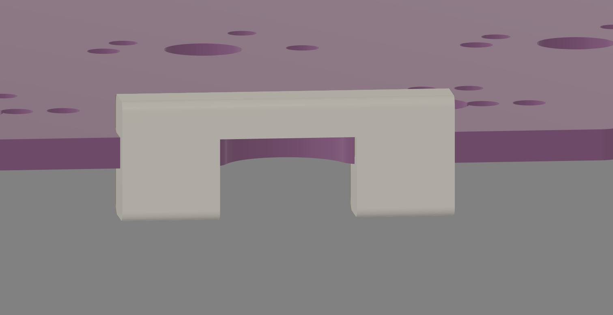

# O-ring Plateless Kit

---
O-ring Plateless Kit - 3D Printed designed by Thai Cong from Vietnam Mechanical Keyboard (VNMK) group.

## Description

With O-ring you have to have a plate to hold the O-ring, otherwise it will just bounce up when you type.

The kit will clip into the PCB for each O-ring cutout, and thanks to the part underneath the PCB, it will help the PCB stay above the O-ring posts, without needing a plate.

The file is designed for TPU printed, optimized for Nozzle 0.2mm print. Only works with 1.6mm PCB. The hardness is about 75A-90A O-ring.

The file was tested and worked with Unikorn, and should work with 1-piece O-ring mount keyboards, or 2-piece O-ring mount keyboards with inner top and bottom case wall aligned.

In case the inside of the case is too loose, you can use tapes in the inner case to reduce the space.

## Files

[Download STL files](./oring-plateless-kit(Free%20For%20Personal%20Use).STL)
