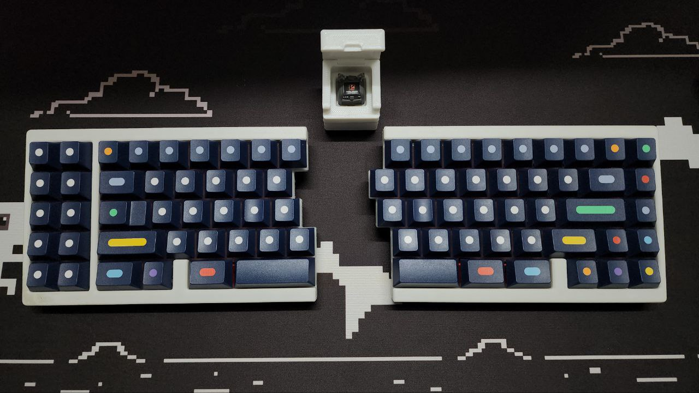
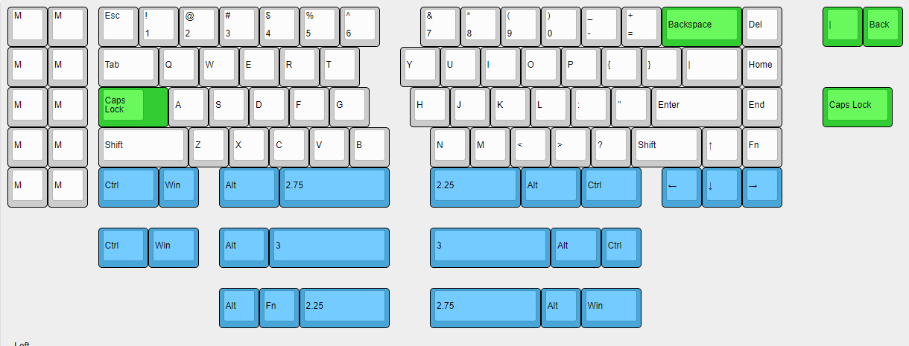
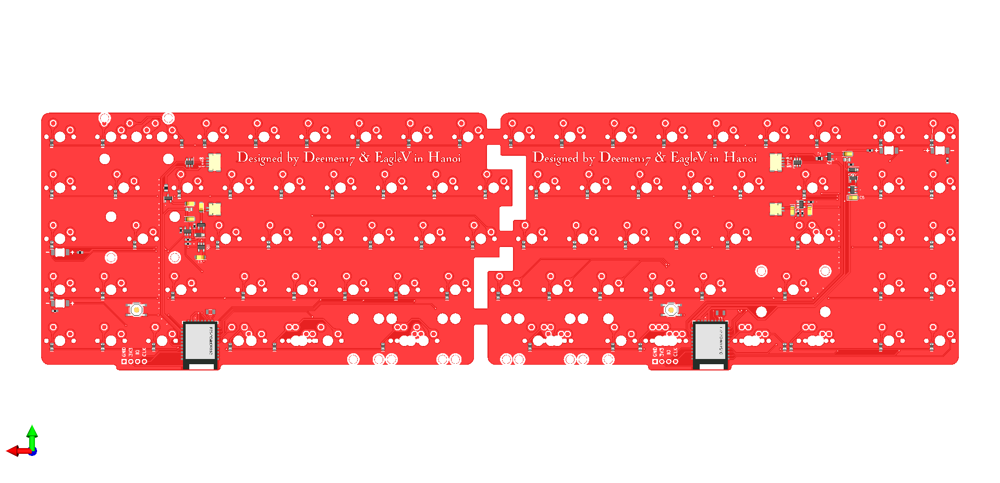
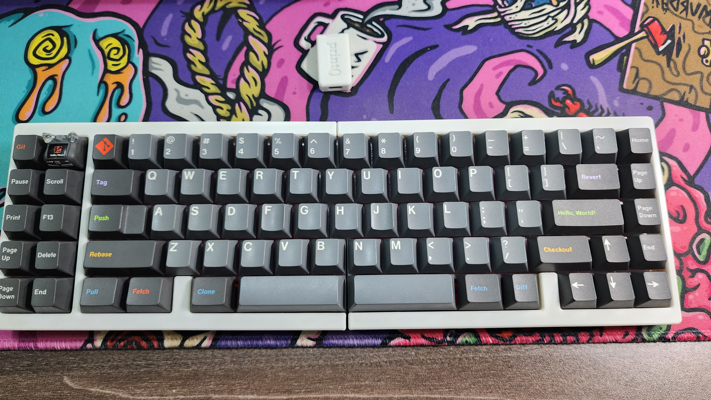
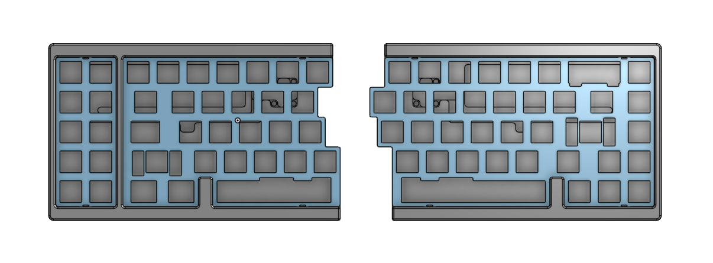
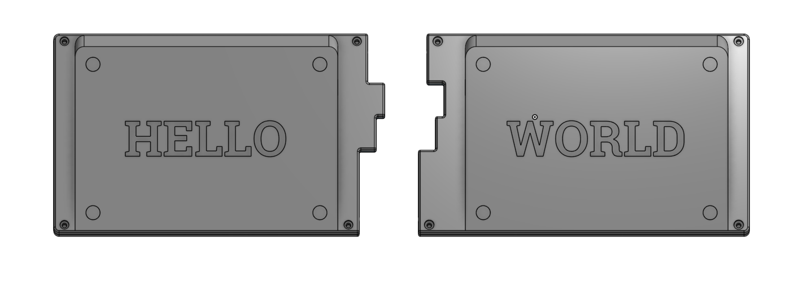
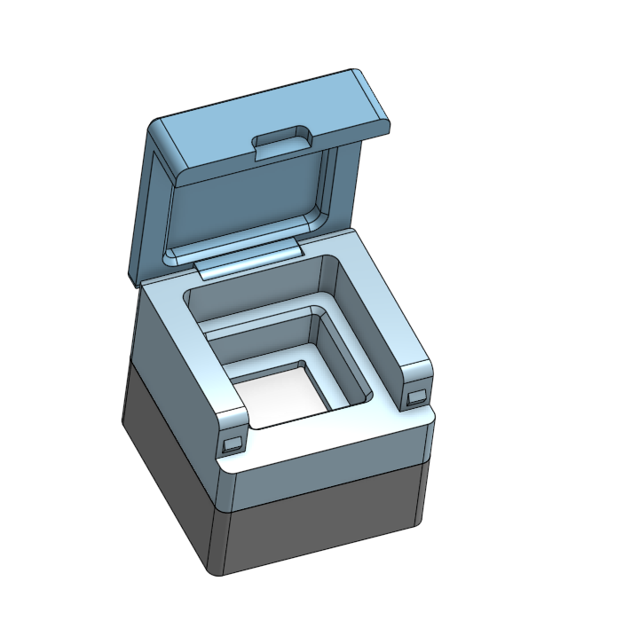
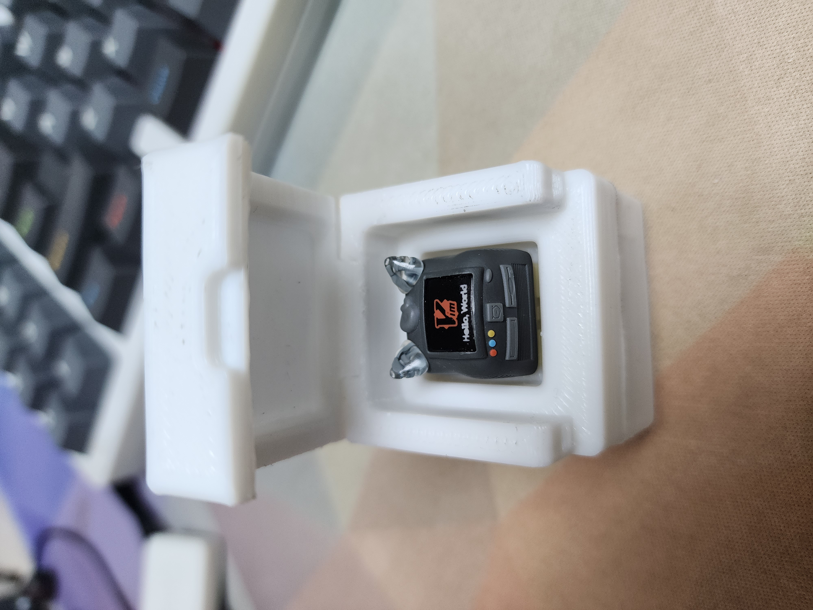
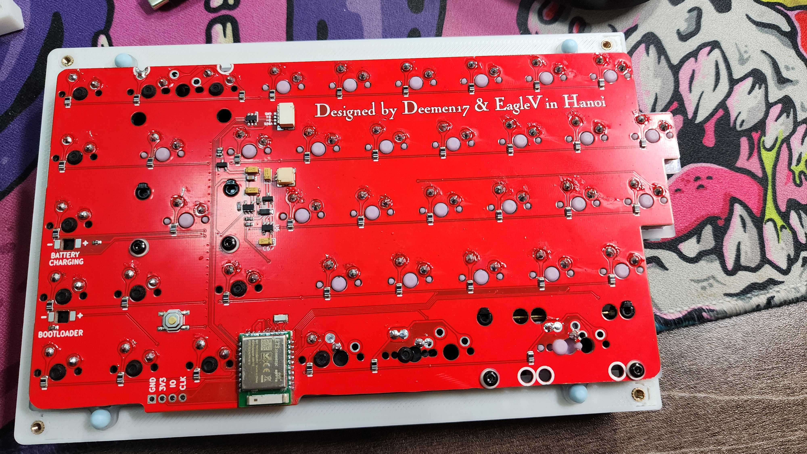

# VU.A - Fully wireless split keyboard with dongle via bluetooth 5.0

---

A wireless keyboard through dongle via bluetooth 5.0, powered by nRFMicro 52840, inspired by [Vincent Nguyen](https://github.com/nguyen-v)'s [Aloidia project](https://hackaday.io/project/189688-aloidia-wireless-split-solar-powered-keyboard).

I've been loving the split and alice keyboards, but they often have a critical flaw (at least for me): they use a 2.25u spacebar on the left side, and I want a longer spacebar on the left so my thumb can be comfortable both when I'm gaming and typing.

And then one day I came across the Aloidia keyboard blog from hackaday, I was immediately hooked. I took the schematic of Vincent and with the help of [Deemen17](https://github.com/Deemen17) made a lesser version, without the solar panel (I tried), but still fully wireless PLUS multi layout PCB.

Then I designed the 3D printed case; the dongle case that hold a single switch to help it enter bootloader faster, even though it probably took about 10 seconds to remove from the case and use a tweezer to shorten the pins lol.

Btw I'm a Mac user so I love my exploded Command key.

This keyboard use Geon's Tad Pole mount for simplicity.

## Video

## PCB layout support

## Resources

- [PCB v1](pcb/gerber_vua_v1.zip)
- [3D Printed Left Case](case/3d_printed_left.step)
- [3D Printed Right Case](case/3d_printed_right.step)
- [Plate Left](case/plate_left.dxf)
- [Plate Right](case/plate_right.dxf)
- [ZMK Firmware repository](https://github.com/EagleVee/zmk-config-vua)

**Disclaimer**: The PCB v1 file won't work with the current case, since we made a mistake and have the bottom of the pcb be too wide. You can still use it but you will need to trim out the bottom part of the PCBs like this, and extrude a bit of the case:

## Pictures

### Double 3u spacebars layout:

### 3D Printed Case Images:

### Dongles:

## PCB:

### Thanks

Special thanks to [Vincent Nguyen](https://github.com/nguyen-v) and [Deemen17](https://github.com/Deemen17) for inspired me and helped me complete this project.
